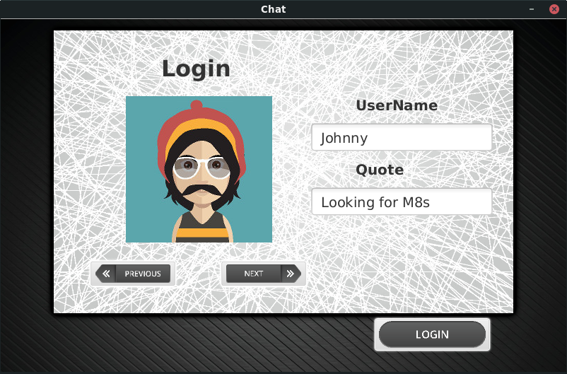
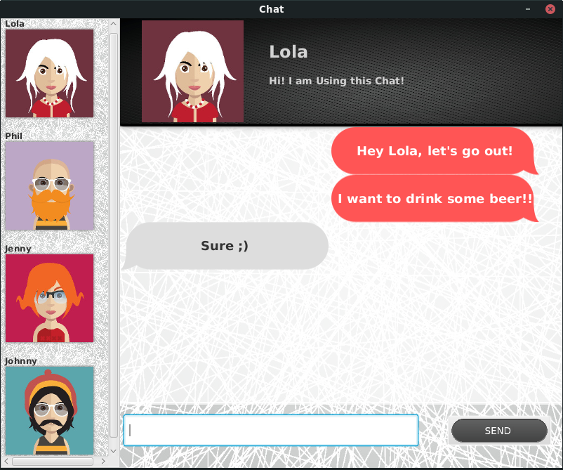

# Chat

A simple application useful for exploring some **Java** code feautures. The idea of this repository is to be a full working point of reference and provides code solutions to beginners and not only them on some tricky points on **developing** **Java** applications, such as:

* **JavaRMI** client server application
* **JavaFX** Gui programming
* **Gradle** project setup 

## How it works

1. Build the project.

    `./gradlew build`
    
2. Start the server jar.

    `java -jar build/libs/Chat_Server.jar`

3. Start any number of clients you want!

    `java -jar build/libs/Chat_Client.jar`

## Licence
### THE BEER-WARE LICENSE

As long as you retain this notice you can do whatever you want with this stuff. If we meet some day, and you think this stuff is worth it, you can buy me a beer in return.
VaporUser, 2018

### Credits

<a href="https://www.freepik.com/free-vector/people-wearing-accesories-avatar-collection_1176016.htm">Designed by Kubanek</a>
<a href='https://www.freepik.com/free-vector/different-designs-of-web-buttons_832143.htm'>Designed by Freepik</a>
<a href='https://www.freepik.com/free-vector/striped-black-background_801315.htm'>Designed by Freepik</a>
<a href='https://www.freepik.com/free-vector/gray-texture-background_1076969.htm'>Designed by Freepik</a> <a href="https://www.Vecteezy.com">www.Vecteezy.com</a>

## Screenshots

